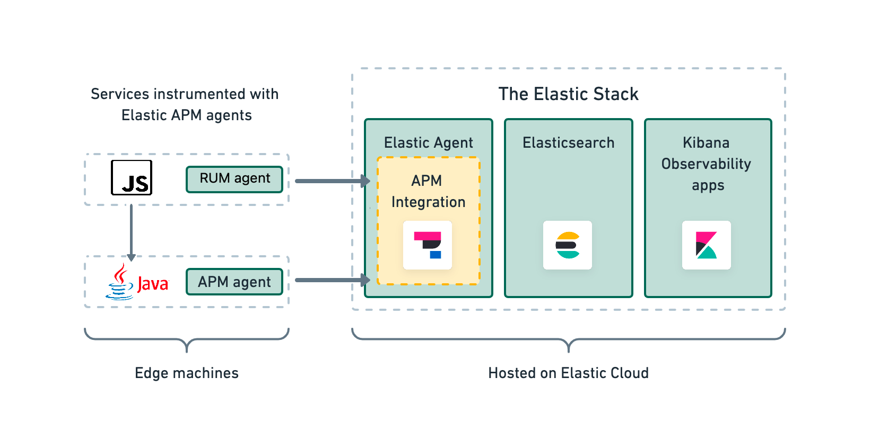

# Rum Record Store: Are They Really Using It?

A monorepo containing several UI and server components showcasing Elastic User Experience Monitoring via JavaScript RUM and Java APM agents. Used to input sample user interaction data into an Elastic Observability dashboard. This project was generated using [Nx](https://nx.dev).

<p style="text-align: center;"></p>

This application provides the code examples for the talk *Are They Really Using It?*, to be given at several forums including:

1. Lean Agile Scotland
2. London Java Community
3. TechMids
4. Modern Frontends Live!

## Overview

### Architecture

The server and React frontend components make use of Elastic APM and RUM agents respectively. These agents establish the communication with the APM server which in turn pushes the events to Elasticsearch for visualisation in Kibana. The architecture is presented below:

<p style="text-align: center;"></p>

### Code Structure

This project comprises several applications, visible within the *apps* folder:

1. *rum-records-server*: Java Spring Boot Webflux Application with Elastic Java APM.
2. *rum-records-react*: JavaScript React UI, connected to *rum-records-server*.
3. *rum-records-angular*: Angular TypeScript UI, currently under development.
4. *rum-records-vanilla*: JavaScript UI application, currently under development.

Each UI component also has a corresponding e2e, or end-to-end, testing suite, implemented using [Cypress](https://www.cypress.io/) and postfixed with e2e. For example, the e2e suite for *rum-records-react* is *rum-records-react-e2e*.

## Running Locally

Running the UI and server together requires starting both components via the below commands from folder *rum-records-store*. Note that the `npm install` command only needs to be run on the first run to download local dependencies from npm.

UI
```
npm install
nx serve rum-records-react
```

SERVER
```
cd apps/rum-records-server
mvn spring-boot:start
```

The application will be available at http://localhost:4200/, connecting to the Java application running at http://localhost:8080/. The app will automatically reload if you change any of the source files.

## Build

To build any apps within the repo, run `nx build my-app` to build the project. The build artifacts will be stored in the `dist/` directory. Use the `--prod` flag for a production build.

## Running unit tests

Run `nx test my-app` to execute the unit tests via [Jest](https://jestjs.io).

Run `nx affected:test` to execute the unit tests affected by a change.

## Running end-to-end tests

Run `npx nx e2e my-app-e2e-suite` to execute the end-to-end tests via [Cypress](https://www.cypress.io).

For example, the e2e suite for rum-records-react, the main UI project, can be run via `npx nx e2e rum-records-react-e2e`. The `--watch` action opens the Cypress suite allowing for tests to be executed and debugged.

[As per this guide](https://docs.cypress.io/guides/guides/cross-browser-testing), Cypress supports test execution across multiple browsers using the `--browser` option. For example, executing tests using chrome is possible via `npx nx e2e rum-records-react-e2e --browser `. To run the test suite across Edge, Chrome and Electron browsers, use the helper command `npm run e2e-rum-react`. Note that each browser must be installed on your local machine for the task to succeed.

## Understand your workspace

Run `nx graph` to see a diagram of the dependencies of your projects.

## Further help

1. [Nx Documentation](https://nx.dev)
2. [Elastic User Experience Overview](https://www.elastic.co/guide/en/observability/current/user-experience.html)
3. [Elastic RUM Agent](https://www.elastic.co/guide/en/apm/agent/rum-js/current/index.html)
4. [Elastic Observability Guide](https://www.elastic.co/guide/en/observability/current/index.html) 

## Credits

Thanks to the individuals whose content has been used in the making of this app.

## Image Credits

- Record Hero on Home Page: [Erik Mclean via Unsplash](https://unsplash.com/photos/9y1cTVKe1IY)
- Record Images Source: [Independent: The 30 greatest album covers of all time, from Oasis, 'Definitely Maybe' to Patti Smith, 'Horses'](https://www.independent.co.uk/arts-entertainment/music/features/best-album-covers-ever-b2144450.html)
