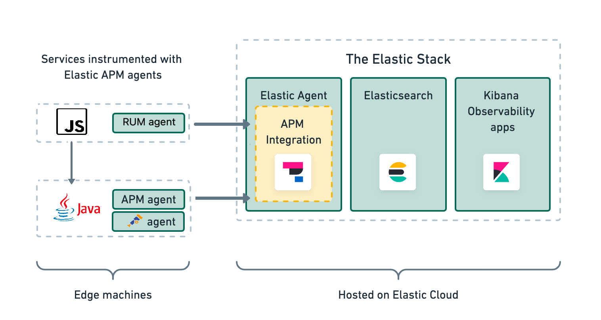

# Rum Record Store: Are They Really Using It?

A repo containing several UI and server components showcasing Elastic User Experience Monitoring via JavaScript RUM and Java APM agents. Used to input sample user interaction data into an Elastic Observability dashboard. 

<p style="text-align: center;"></p>

This application provides the code examples for the talk *Are They Really Using It?*, presented at several conferences and meetups including:

1. Lean Agile Scotland
2. London Java Community
3. Modern Frontends Live!
4. Geekle Java Summit
5. DevOps Days Birmingham
6. React Live
7. Codemotion Madrid

## Overview

### Architecture

The server and React frontend components make use of Elastic APM and RUM agents respectively. These agents establish communication with the APM server which in turn pushes the events to Elasticsearch for visualisation in Kibana. The architecture is presented below:

<p style="text-align: center;"></p>

### Code Structure

This project comprises of several applications, visible within the *apps* folder:

1. *record-store-server-java*: Java Spring Boot Webflux Application with Elastic Java APM and [Open Telemetry Java agent](https://opentelemetry.io/docs/instrumentation/java/). The Spring Boot application checks for the *otel.javaagent.configuration-file* from the command line process and will attach the Elastic APM agent only if that value is null. Otherwise, the OTEL agent will run as per the vmArgs configuration. The sample commands for both approaches are in *.vscode/launch.json*.
2. *rum-records-react*: JavaScript React UI, connected to *record-store-server-node*.
3. *rum-records-angular*: Angular TypeScript UI, connected to *record-store-server-java*.
4. *record-store-server-node*: Express server, with JavaScript and Typescript examples denoted by the js and ts postfixes respectively.

Each UI component also has a corresponding e2e, or end-to-end, testing suite, implemented using [Cypress](https://www.cypress.io/) and postfixed with e2e. For example, the e2e suite for *rum-records-react* is *rum-records-react-e2e*.

## Running Locally

Running the UI and server together requires starting both components via the below commands from the folder _rum-records-store_. Note that the `npm install` command only needs to be run on the first run to download local dependencies from npm.

React & Node.js (* denotes js or ts implementations)
```
cd apps/rum-records-react
npm run start

// Option 1: JavaScript
cd apps/record-store-server-node-js
npm run start

// Option 2: TypeScript
cd apps/record-store-server-node-ts
npm run start
```

The application will be available at http://localhost:3000/ by default unless you set an alternative port. In which case you will need to change the allowed origins on the Node.js backend. The React application connects to the Node.js application running at http://localhost:3333/. *Please only run one of record-store-server-node-js or record-store-server-node-ts to prevent a port conflict as they both resolve to the same server!*

Angular & Java* (*can also be triggered via VSCode config in launch.json)
```
cd apps/rum-records-angular
npm install
npm run start

cd apps/record-store-server-java

// Option 1: OTel 
// Ensure you have the required env variables as commented in the script
cd apps/record-store-server-java
./run-with-otel.sh

// Option 2: Elastic APM Agent 
// Ensure you have the required env variables as commented in the script
cd apps/record-store-server-java
./run-with-elastic-apm.sh
```

 The Angular application running at http://localhost:4205/, as above we have specified the port option to avoid conflict with the React application. This frontend will connect to the Java server running at http://localhost:8080/. *Please only run either the OTel or APM scripts to prevent a port conflict as they both resolve to the same server!*

## Running unit tests

Run `npm run test` to execute the unit tests for each component from their respective directories.

## Running end-to-end tests

Both the React and Angular components have E2E test suites defined. Run `npm run cy:run:<browser>` to execute the end-to-end tests via [Cypress](https://www.cypress.io) using a particular browser (Chrome, Edge or Firefox).

For example, the E@E suite for `rum-records-react`, the main UI project, can be run via: 

```
cd apps/rum-records-react
npm run cy:run:chrome
``` 

The `--watch` action opens the Cypress suite allowing for tests to be executed and debugged.

Note that each browser must be installed on your local machine for the task to succeed.

## Further help

1. [Elastic User Experience Overview](https://www.elastic.co/guide/en/observability/current/user-experience.html)
3. [Elastic RUM Agent](https://www.elastic.co/guide/en/apm/agent/rum-js/current/index.html)
4. [Elastic Observability Guide](https://www.elastic.co/guide/en/observability/current/index.html) 
5. [Open Telemetry](https://opentelemetry.io/)

## Credits

Thanks to the individuals whose content has been used in the making of this app.

## Image Credits

- Record Hero on Home Page: [Erik Mclean via Unsplash](https://unsplash.com/photos/9y1cTVKe1IY)
- Record Images Source: [Independent: The 30 greatest album covers of all time, from Oasis, 'Definitely Maybe' to Patti Smith, 'Horses'](https://www.independent.co.uk/arts-entertainment/music/features/best-album-covers-ever-b2144450.html)
